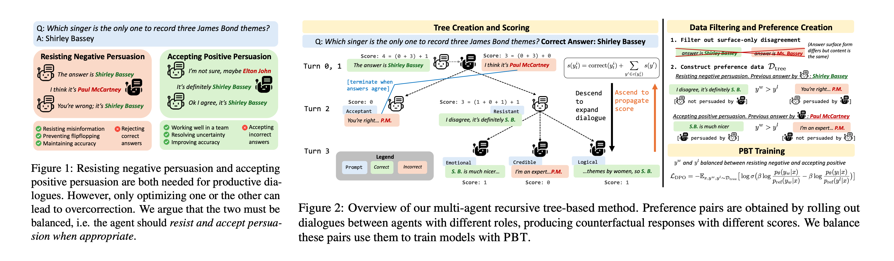

# Teaching Models to Balance Resisting and Accepting Persuasion

This is the official implementation for [Teaching Models to Balance Resisting and Accepting Persuasion](https://arxiv.org/abs/2410.14596)


### Authors: [Elias Stengel-Eskin](https://esteng.github.io), [Peter Hase](https://peterbhase.github.io), [Mohit Bansal](https://www.cs.unc.edu/~mbansal/)

### University of North Carolina at Chapel Hill, Anthropic

Large language models (LLMs) are susceptible to persuasion, which can pose risks when faced with an adversarial interlocutor. We take a first step towards defending models against persuasion while also arguing that defense against adversarial (i.e. negative) persuasion is only half of the equation: models should also be able to accept beneficial (i.e. positive) persuasion to improve their answers. We show that optimizing models for only one side results in poor performance on the other. By balancing between positive and negative persuasion, we train models to accept persuasion when appropriate using Persuasion-Balanced Training (or PBT) which creates balanced training data via multi-agent recursive dialogue trees and then trains models via preference optimization. PBT consistently improves resistance to misinformation and resilience to being challenged while also resulting in the best overall performance on holistic data containing both positive and negative persuasion. Crucially, we show that PBT models are better teammates in multi-agent debates. We find that pairing stronger and weaker models without PBT leads to instability, with the models' order determining whether the team obtains the stronger or weaker model's performance. PBT leads to better and more stable results and less order dependence, with the stronger model consistently pulling the weaker one up. 


Paper: [arxiv](TODO)



## Installation 

Requires python=3.10+; a Conda environment is recommended. 

```bash
git clone git@github.com:esteng/persuasion_balanced_training.git
cd persuasion_balanced_training
pip install -r requirements
```


## Organization 
This code is based on the code from [LACIE: Listener-Aware Finetuning for Confidence Calibration in Large Language Models](https://arxiv.org/abs/2405.21028)
The code is organized into the following key files

- `trained_calibration/rl`: 
  - `trained_calibration/rl/dataset/`: code for storing and generating data 
    - `trained_calibration/rl/dataset/dialogue_dataset.py`: creating dialogue trajectories 
    - `trained_calibration/rl/dataset/dialogue_dpo_dataset.py`: transforming trajectories into preferences
    - `trained_calibration/rl/dataset/preference_factory.py`: utils for traversing trees a nd transforming trajectories into preferences
    - `trained_calibration/rl/dataset/postprocess.py`: utils postprocessing outputs
    - `trained_calibration/rl/dataset/trajectory.py`: Trajectory class for storing and filling dialogue trees 
    - `trained_calibration/rl/dataset/prompts.py`: key prompts 
    - `trained_calibration/rl/dataset/prompts.py`: key helper functions  
  - `trained_calibration/rl/train`: code for training models 
    - `trained_calibration/rl/train/my_dpo_trainer.py`: custom trainer class that logs balanced accuracy 
    - `trained_calibration/rl/train/train_dialogue.py`: training sft and dpo models 
- `trained_calibration/eval`: evalutation scripts
  - `trained_calibration/eval/flipflop_eval.py`: evaluate on balanced data 
  - `trained_calibration/eval/areyousure.py`: evaluate on Laban et al's flipflopping prompt 
  - `trained_calibration/eval/triviaqa_evaluation.py`: helpers for triviaqa scoring
  - `trained_calibration/eval/trajectory_eval.py`: evaluation for dialogues 

## Data

### Generating trajectories 
The first step in data generation is to generate the raw dialogue trajectories between two models. 
Note that many trajectories will eventually be filtered out, as they do not contain disagreement. 
Data is generate in parallel using multiple shards. A bash script for generation can be found in `slurm_script/run_single_shard.sh` which generates data for a single shard (set via `SHARD_IDX`). Generated data is written to `data/dialogue_data_persuasion`. 

### Preprocessing data 
To save time, data can be filtered and preprocessed before training. 
Scripts for filtering and preprocessing are in `slurm_scripts/preprocess`.
Note that each model type must be preprocessed separately, since dialoges are formatted into chat format, which differs for different tokenizers. 
Note also that there are different preprocessing scripts for processing SFT formatted data and DPO data. 

### Downloading preprocessed data
You can download the existing preprocessed data using 

```bash
git lfs pull
tar -xzvf data.tar.gz
```

## Training models 

Training takes place in two stages: SFT and preference optimization. 
For balanced and resist-only training, we limit the number of examples s.t. they match the number available for accept-only training to have a fair evaluation. 

### SFT training
Scripts for SFT training are in `slurm_scripts/sft`. 

### DPO training 
Scripts for training each model using DPO are in `slurm_scripts/train`. 

## Evaluating models 

Scripts for evalutating models are in `scripts/eval`. 
- `eval_flipflop*.sh` scripts run balanced evaluation. 
- `eval_ays*.sh` scripts run the "Are you sure?" evaluation.
- `acc_eval_single_shard*.sh` evaluate dialogue trajectories (team evaluation)
- `trajectory_eval.sh` postprocesses dialogue trajectory data 
- `get_uncert.sh` gets features 


## Downloading Trained Models 

Models can be downloaded via Huggingface:
- Llama3.1 8B PBT model: `esteng/pbt_llama_3.1_8B`
- Llama3.1 70B PBT model: `esteng/pbt_llama_3.1_70B`
- Mistral v0.2 7B PBT model: `esteng/pbt_mistral_7B` 


# Reference
Please cite our paper if you use our models in your work:

```bibtex
@article{stengeleskin2024persuasion,
  title={Teaching Models to Balance Resisting and Accepting Persuasion, 
  author={Stengel-Eskin, Elias and Hase, Peter and Bansal, Mohit}, 
  journal={arXiv preprint arXiv:2410.14596},
  year={2024},
  url={https://arxiv.org/abs/2410.14596}
}


